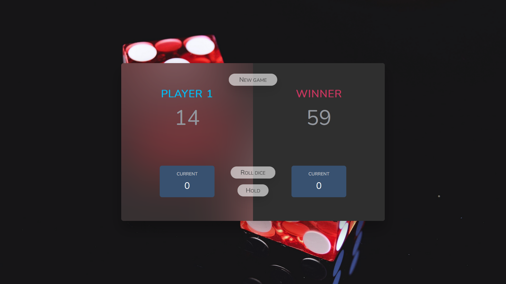

# Pig Game

Pig is a simple dice game first described in print in John Scarne in 1945. Players take turns to roll a single die as many times as they wish, adding all roll results to a running total, but losing their gained score for the turn if they roll a 1.

## Gameplay

Each turn, a player repeatedly rolls a die until either a 1 is rolled or the player decides to "hold":

    If the player rolls a 1, they score nothing and it becomes the next player's turn.
    If the player rolls any other number, it is added to their turn total and the player's turn continues.
    If a player chooses to "hold", their turn total is added to their score, and it becomes the next player's turn.

The first player to score 100 or more points wins.(in my version of the game only 50 points are needed to win the game because reaching 100 points takes to much time).

## Game Images

